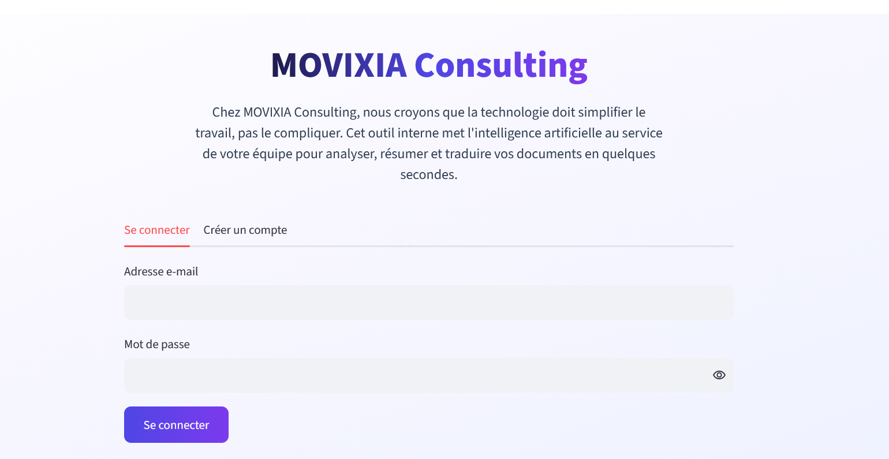
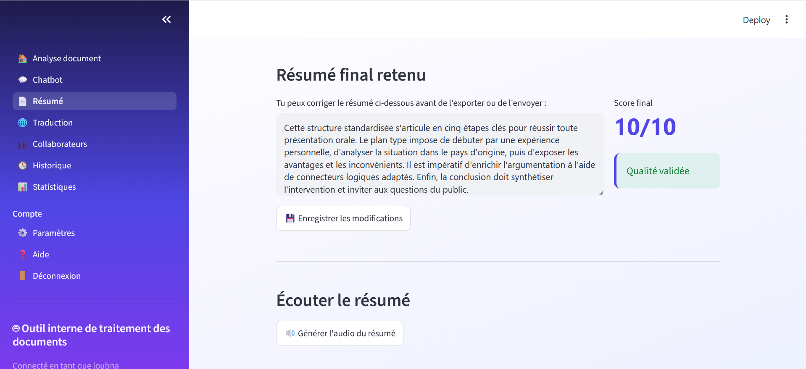
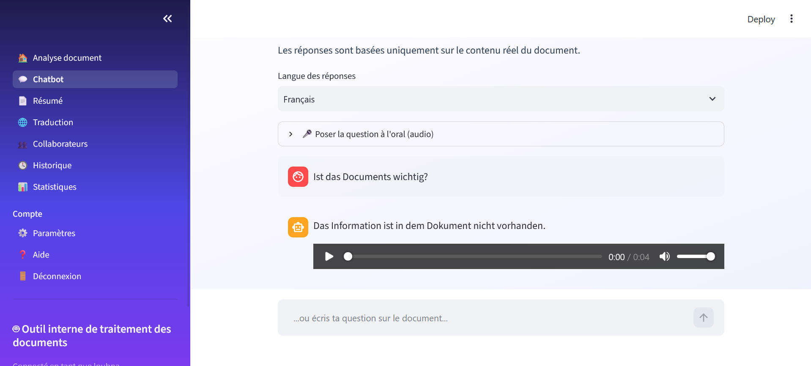
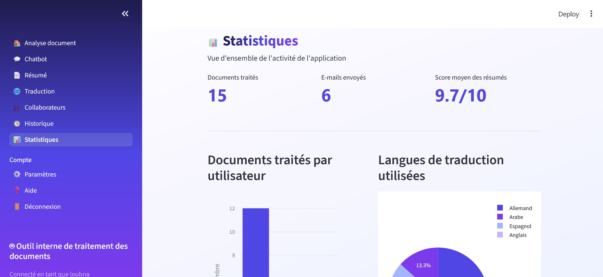

# DocuMind MOVIXIA


**Application web multi-agent pour le traitement et l'analyse intelligente de documents d'entreprise** — résumé fiabilisé, traduction multilingue, chatbot documentaire (RAG) et assistant vocal, développée dans le cadre d'un stage de fin d'études chez MOVIXIA CONSULTING.

> Un document entre, un résumé vérifié, traduit et interrogeable en ressort — sans jamais sortir du contenu réel du document.

---

## Aperçu

| Écran de connexion | Résumé éditable + audio |
|---|---|
|  |  |

| Chatbot vocal multilingue | Tableau de bord statistique |
|---|---|
|  |  |

---

## Fonctionnalités

- **Extraction multi-format** — import de fichiers `.txt`, `.pdf` ou `.docx`, normalisés automatiquement en texte.
- **Résumé fiabilisé par boucle qualité** — un agent Rédacteur génère le résumé, un agent Critique l'évalue sur 10 et le renvoie en correction si le score est insuffisant (jusqu'à 3 itérations).
- **Personnalisation du résumé** — choix du ton (synthétique, détaillé technique, formel) et édition manuelle avant export ou envoi.
- **Traduction automatique** dans 6 langues (allemand, anglais, espagnol, italien, portugais, arabe).
- **Chatbot documentaire (RAG)** — questions-réponses ancrées dans le contenu réel du document via recherche par similarité vectorielle, sans hallucination.
- **Assistant vocal bidirectionnel** — question à l'oral (micro ou fichier audio) et réponses lues à voix haute, dans la langue choisie.
- **Export** du résumé et de la traduction en Word (`.docx`) et PDF.
- **Authentification sécurisée** (mots de passe hachés SHA-256) et diffusion des résultats par e-mail aux collaborateurs, avec identité et signature automatiques.
- **Historique et tableau de bord** — traçabilité de l'activité et statistiques d'usage (Plotly, pandas).

## Architecture

```
Document (.txt / .pdf / .docx)
        │
        ▼
 [1] Extraction  ───────────────►  texte normalisé
        │
        ▼
 [2] Agent Rédacteur  ──────────►  génère un résumé
        │
        ▼
 [3] Agent Critique  ───────────►  note /10 + feedback
        │   (si score < 7, retour à [2], jusqu'à 3 fois)
        ▼
 [4] Agent Traducteur (optionnel) ─►  traduction (6 langues)
        │
        ▼
 [5] Module RAG / Chatbot  ─────►  questions-réponses sur le document
```

## Structure du projet

```
documind-movixia/
├── app.py                  # Point d'entrée — authentification + navigation
├── agents.py                # Agents Rédacteur, Critique, Traducteur
├── rag.py                   # Découpage, embeddings, recherche par similarité (RAG)
├── auth.py                   # Création de compte, connexion, hachage des mots de passe
├── extraction.py             # Extraction multi-format (.txt / .pdf / .docx)
├── export.py                 # Génération des exports Word et PDF
├── audio.py                  # Synthèse vocale et transcription audio
├── historique.py              # Journalisation de l'activité
├── style.py                   # Charte graphique de l'interface
├── lister_modeles.py           # Script utilitaire listant les modèles Gemini disponibles
├── requirements.txt
├── pages/
│   ├── accueil.py             # Analyse document
│   ├── chatbot.py
│   ├── resume.py
│   ├── traduction.py
│   ├── collaborateurs.py       # Diffusion par e-mail
│   ├── historique.py
│   ├── statistiques.py
│   ├── parametres.py
│   ├── aide.py
│   └── deconnexion.py
└── screenshots/
```

## Stack technique

| Composant | Technologie |
|---|---|
| Langage | Python |
| Interface web | Streamlit (navigation multi-pages) |
| Modèle de langage | Google Gemini API (génération, embeddings, compréhension audio) |
| Recherche sémantique | NumPy (embeddings + similarité cosinus) |
| Extraction de documents | pypdf, python-docx |
| Export de documents | python-docx, fpdf2 |
| Synthèse vocale | gTTS |
| Visualisation | Plotly, pandas |
| Envoi d'e-mails | smtplib (SMTP sécurisé) |
| Secrets | python-dotenv |

## Installation locale

```bash
git clone https://github.com/ton-nom-utilisateur/documind-movixia.git
cd documind-movixia

python -m venv venv
source venv/bin/activate      # Windows : venv\Scripts\activate

pip install -r requirements.txt

cp .env.example .env          # puis renseigne tes propres clés dans .env
```

Le fichier `.env` doit contenir :
```
GOOGLE_API_KEY=ta_cle_gemini
GMAIL_ADDRESS=ton_compte@gmail.com
GMAIL_APP_PASSWORD=ton_mot_de_passe_application
```

```bash
streamlit run app.py
```

## Démo en ligne

Une version de démonstration est disponible ici : **[lien à ajouter après déploiement]**

## Limites actuelles

- Authentification fonctionnelle mais simplifiée (pas de niveau sécurité production).
- Historique conservé en fichier local plutôt qu'en base de données.
- Synthèse vocale et transcription nécessitent un accès réseau.
- Performances liées aux quotas du fournisseur du modèle de langage.

## Contexte

Projet réalisé dans le cadre d'un stage de fin d'études (4ème année, Ingénierie Informatique — option Intelligence Artificielle & Sciences de Données, EMSI Rabat), au sein de **MOVIXIA CONSULTING**, sous la supervision de M. Mhamed Idrissi, Ingénieur Full Stack.

## Auteur

**Loubna Rhoufal**
[LinkedIn](#) · [Portfolio](#) · rflloubna@gmail.com

## Licence

Ce projet est distribué sous licence MIT — voir le fichier `LICENSE`.
